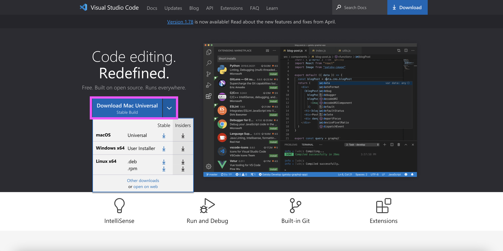
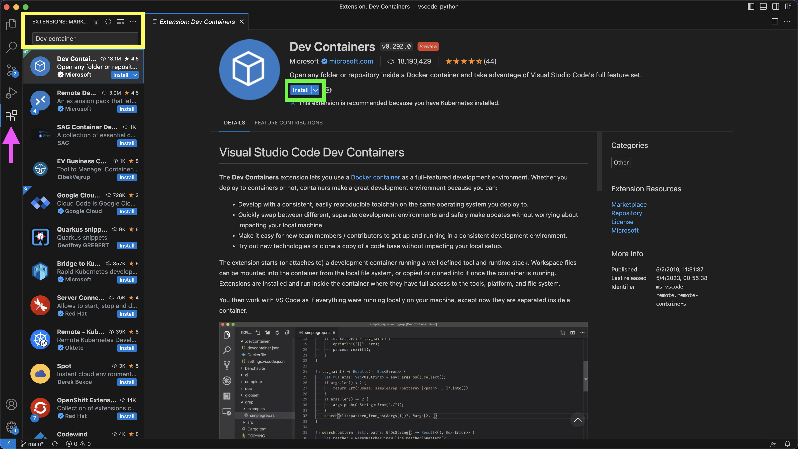
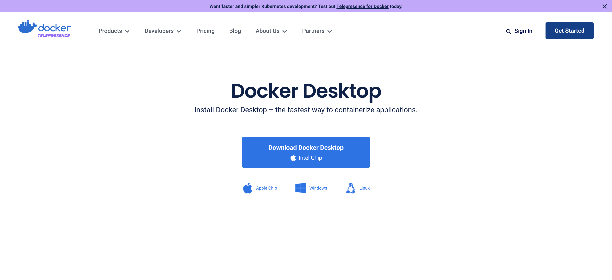
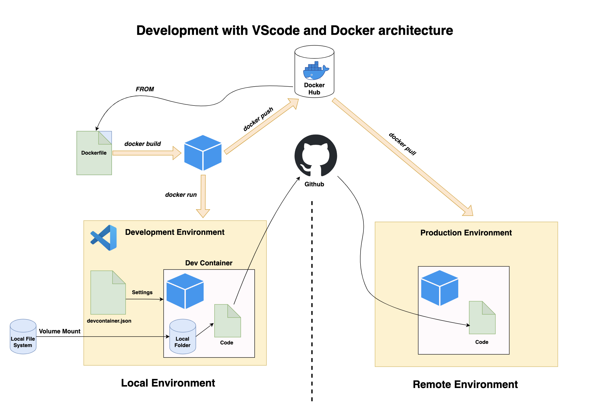
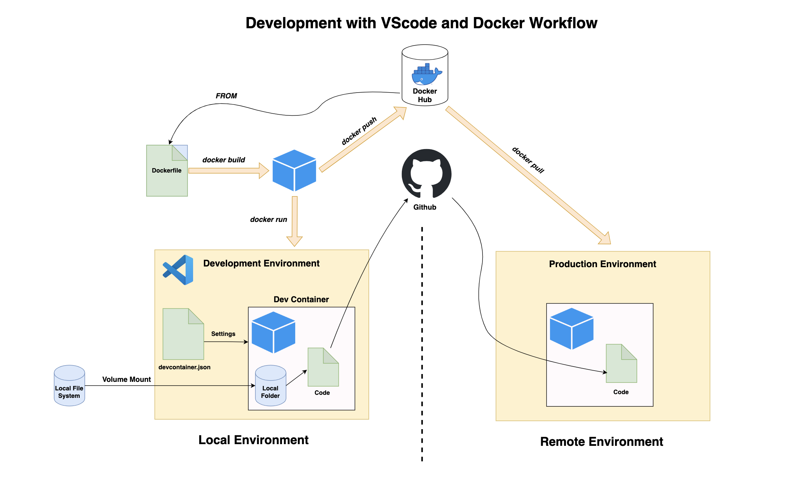
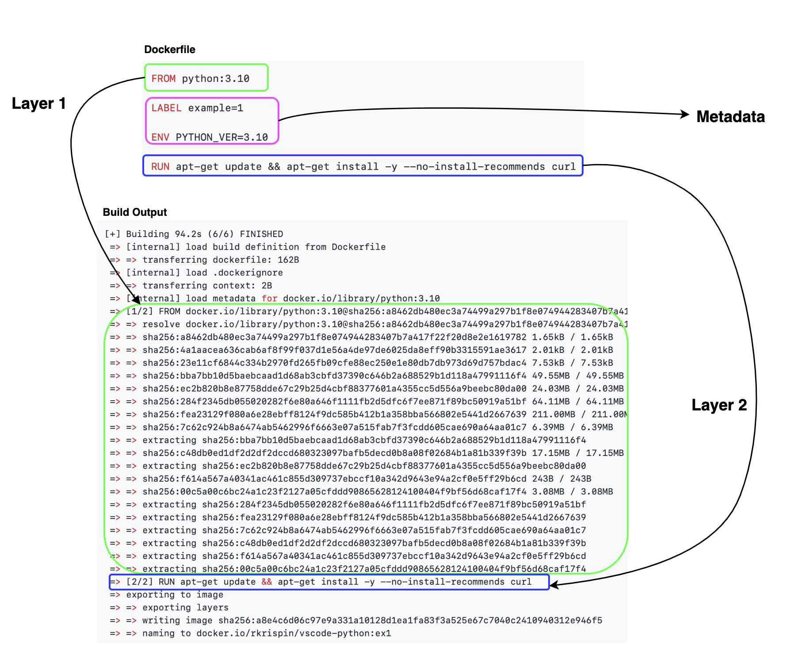

# Setting Python Development Environment with VScode and Docker

WIP 🚧 🏗 pre spellcheck

This repo provides a step-by-step guide and a template for setting up a Python 🐍 development environment with VScode and Docker 🐳. Docker is an amazing tool, but it has some learning curve. This tutorial aims to reduce the entry barrier for learning tools such as Docker.

## Table of contents
- Motivation
- Scope
- Prerequisites 
- General Architecture and Workflow
- Getting Started with Docker 🚧 WIP 🏗
- Docker with Python - the Hard Way 🚧 WIP 🏗
- Setting Python Environment with Docker  🚧 WIP 🏗


## Motivation

If you have never used Docker or VScode, this section explains the advantages of each tool and why they work so well together.

### Why develop with Docker 🐳?

Docker is a CI/CD tool that enables seamless code deployment from development to production environments. By creating OS-level virtualization, it can package an application and its dependencies in a virtual container and ship it between different environments. The main advantages of using Docker within your development environment are:
- **Reproducibility** - Docker enables you to seamlessly package your code and its dependencies into a single container and execute, test, share, and deploy it with a high level of consistency
- **Collaboration** - Docker solves the dependencies madness when a team of developers works together on a specific project. Having a unified environment saves a ton of time during the development step. For example, if one developer gets some error, it is easy for other developers to reproduce the error and help debug it
- **Deployment** - Docker simplify the code shipment from the development environment to the production


### Why VScode 💻?

VScode (aka Visual Studio Code) is a general-purpose free code editor developed by Microsoft. It can be run locally on Windows, macOS, and Linux OSs or on a cloud environment. The main advantages of using VScode as your IDE are:
- **Multi-languages** - VScode supports out-of-the-box JavaScript, TypeScript, and Node.js, and has a variety of extensions that enable running other programming languages such as Python, C++, C#, Go, etc.
- **Extensions** - VScode has a large community support that builds and maintains a variety of extensions that extend the editor's capabilities and functionality. That includes extensions that support programming languages (such as Python, R, and Julia), plugs-in that enables connection with external applications (Docker, Postgres, etc.), and other applications
- **Git integration** - VScode has built-in integration with Git
- **Docker integration** - VScode supports natively Docker integration, which we will dive deep into in the coming sections

In addition, VScode is free and open source 🌈.

### VScode + Docker + Python=  ❤️ ❤️ ❤️

Docker's high reproducibility, coupled with the seamless integration of Visual Studio Code with Docker, makes it a great development tool, particularly for Python developers. This integration enables developers to easily create, test, and deploy their Python applications in a consistent and reproducible environment, ensuring that their code runs as expected. 


## Scope

This tutorial focuses on setting up a dockerized Python development environment with VScode. We will explore how to integrate VScode with Docker using Microsoft's [Dev Container](https://marketplace.visualstudio.com/items?itemName=ms-vscode-remote.remote-containers) extensions and show various of methods for configuring a Python environment with Docker. However, it's important to note that while this tutorial covers some of the core Docker features, it is not a complete Docker guide. If you don't have previous experience with Docker, I highly recommend taking one of the Docker crash courses.

## Prerequisites 

Generally, this tutorial does not require a previous experience with Docker and VScode. In line with the tutorial scope above, the goal is to teach you how to set up a Python development environment using Docker and VScode. That being said, as mentioned above, you will benefit more from and highly utilize this tutorial if taking some Docker intro courses before starting this tutorial.

The main requirements for this tutorial are setting VScode and Docker Desktop. In addition, you will need to set up an account to Docker Hub.

### Installing VScode

Installing VScode is straightforward - go to the VScode website https://code.visualstudio.com/ and click on the Download button (purple rectangle on the screenshot):

</a>

Download the installation file and follow the instructions. 

To set the Python environment with Docker in VScode we will need the following extensions:

- **Dev Containers** - this extension enables to open a folder and execute a code inside a Docker container (more info available [here](https://marketplace.visualstudio.com/items?itemName=ms-vscode-remote.remote-containers))
- **Python** - the main Python plug-in for VScode, enables to execute, debugging, code navigation, code formatting, etc. (more info available [here](https://marketplace.visualstudio.com/items?itemName=ms-python.python))

Here is how to install an extension on VScode: 
- Click the Extensions button on the left menu (mark with a purple arrow on the screenshot below) 
- Type the extension name on the search menu (see the yellow rectangular). You can see the search results below, and clicking on each extension will open a window with the extension details. 
- Last but not least, Click the install button (see the green rectangular) to install the extension

</a>

**Note:** The Dev Containers extension is required to launch the dockerized environment. We will see later in this tutorial how to set and install the necessary extensions for your dockerized environment automatically with the `devcontainer.json` file.

### Setting Docker
Various ways exist to build and run Docker images on different operations systems. For the purpose of this guide, we will be utilizing Docker Desktop. It is a user-friendly container management interface that is compatible with MacOS, Windows, and Linux operating systems.

**Note:** Docker Desktop is free for personal use but requires a license for commercial use. For further information, please refer to https://www.docker.com/pricing/.

To install Docker Desktop, go to Docker website and follow the installation instructions according to your OS:

 </a>


### Docker Hub

Container Registry has a similar functionality as Github for code, and it uses to store and share images. There are many container registries, and the most common is  Docker Hub. We will use throughout the tutorial Docker Hub to pull different images, such as Python built-in images. To register and create an account go to https://hub.docker.com and follow the registration instructions.

After installing Docker Desktop and setting account on Docker Hub, open Docker Desktop, and from the command line, login to Docker Hub:

``` shell
 docker login
```

You will have to enter your username and password, and you should expect the following output if the login is successful:

``` shell
Login with your Docker ID to push and pull images from Docker Hub. If you don't have a Docker ID, head over to https://hub.docker.com to create one.
Username: rkrispin
Password:
Login Succeeded

Logging in with your password grants your terminal complete access to your account.
For better security, log in with a limited-privilege personal access token. Learn more at https://docs.docker.com/go/access-tokens/
```
**Note:**  Docker Hub is completely public (for the free tier). Any image you push and store there will be available for all other users. Regardless if your container registry is public or not, **NEVER** store credentials, passwords, or any other sensitive information on your Docker images. 


### Hello World!

There is no better way to test if Docker was installed properly than by running whalesay (or 🐳  say) Docker's most `Hello World!` common example. The whalesay is an adaption of the Linux cowsay (🐮 say) game using a whale instead of a cow to print some text. Let's run the below code from the terminal to print `Hello Python Users! 👋 🐍`:

``` shell
docker run docker/whalesay cowsay Hello Python Users! 👋 🐍
```
If this is the first time you are using Docker or your first time using the `whalesay` image you should expect the following message:

``` shell
Unable to find image 'docker/whalesay:latest' locally
```

That is a generic message that notifies that the requested image cannot be found locally, and Docker will try to pull the image from the hub (if specified) and follow by downloading the image:


``` shell
latest: Pulling from docker/whalesay
Image docker.io/docker/whalesay:latest uses outdated schema1 manifest format. Please upgrade to a schema2 image for better future compatibility. More information at https://docs.docker.com/registry/spec/deprecated-schema-v1/
e190868d63f8: Pull complete
909cd34c6fd7: Pull complete
0b9bfabab7c1: Pull complete
a3ed95caeb02: Pull complete
00bf65475aba: Pull complete
c57b6bcc83e3: Pull complete
8978f6879e2f: Pull complete
8eed3712d2cf: Pull complete
Digest: sha256:178598e51a26abbc958b8a2e48825c90bc22e641de3d31e18aaf55f3258ba93b
Status: Downloaded newer image for docker/whalesay:latest
```

And this is the expected output:

``` 
_______________________________
< Hello Python Users! 👋 🐍 >
 -------------------------------
    \
     \
      \
                    ##        .
              ## ## ##       ==
           ## ## ## ##      ===
       /""""""""""""""""___/ ===
  ~~~ {~~ ~~~~ ~~~ ~~~~ ~~ ~ /  ===- ~~~
       \______ o          __/
        \    \        __/
          \____\______/
```

If you are able to run the `whalesay` app you are ready to get started with Docker.

## General Architecture and Workflow

Before diving into the core functionality of Docker, let's review the generic development workflow architecture with Docker. Docker has similar functionality as Git and Github (or Gitlab, Bitbucket, etc.), enabling shifting your environment and settings (as opposed to code with Git) from one environment to another one (e.g., dev -> staging or dev -> prod) ensuring a high level of reproducibility. As a matter of fact those two (Docker and Git) go together side by side.


### General architecture

The diagram below describes a high-level architecture of a Dockerized development environment with VScode. It might be overwhelming if you have never used Docker before, and it will make more sense (I hope) by the end of this section.

</a>

This process includes the following components:
- **Dev Container** - is the VScode extension that enables you to execute your local code inside a dockerized environment seamlessly. By default, it mounts your local folder to the docker environment ensuring your code runs inside the container and lives locally.
- **devcontainer.json** - is the Dev Container configuration file that enables you to highly customize your VScode development environment when using the Dev Container extension. From settings the VScode options (e.g., fonts, list of extensions to install, etc.) to the Docker settings (similar to the docker-compose.yml file functionality)
- **Dockerfile** - is the image manifest or recipe. It provides instructions for the docker engine about which base image to use and what components to install. Typically, you start the build process by importing some base image using the `FROM` command, which we will explain later in this tutorial. The Dev Container extension enables you to build the image on the fly when launching the environment using the Dockerfile or import a built-in image from some image registry such as Docker Hub.
- **Image registry** - has similar functionality as Github / Gitlab / Bitbucket, and it is used to store public images (or private on some enterprise versions). The image registry lets you shift and distribute your images from one environment to another. In this tutorial, we will use the main image registry - Docker Hub. 
- **Code registry** - beyond version control, it enables you to shift your code from one environment to another. In this tutorial, we will use Github as our code registry.

**Note:** Regardless if you are using a private or public image registry, as a good practice, you should **NEVER** store passwords, credentials, or any sensitive information on your images. Rather, add environment variables or load information from a mounted volume during the image run time.

### Development workflow
Let's now organize and order this process to a general workflow. The below diagram defines a general order of operation for the development process applying the following steps:
- **Install dependencies** - setting the prerequisites, including installing VScode and the required extensions (e.g., Dev Container, etc.), installing Docker, and setting a Docker Hub account (or equivalent)
- **Set the Dockerfile** - this step is optional, if you wish to build your image on the fly. Alternatively, you can import a built-in image from an image registry and skip this step. In the next section, we will dive into more details about the core functionality of the Dockerfile and how to set it
- **Set the devcontainer.json file** - this file defines the environment and enables you to customize both the VScode functionality and VScode settings. Later in this tutorial, we will see how to set this file
- **Development** - once the `devcontainer.json` file is set, you can launch your dockerized development environment using the Dev Container extension on your local folder. 
- **Testing** - this is a recommended intermediate step before shipping your code and environment to deployment. There are multiple approaches to code and environment testing, and the main goal is to ensure that your code sync with the dockerized environment and identify potential problems before deploying it.
- **Deployment** - last but not least, using code and container registry (e.g., Github and Docker Hub), we can deploy our code using the same dockerized environment to some remote server (e.g., Github Actions, AWS, GCP, Azure, etc.) or have your peers run your code in their computer. 


</a>

In the next section, we review Docker basic commands and learn how to set a Dockerfile. 

## Getting started with Docker
Generally, the VScode **Dev Container** extension lets you containerize your environment by importing a built-in image. However, often, you may want to add more layers (e.g., install additional dependencies) or build it yourself. This section focuses on the essential Docker requirements that will enable you to build your image and run it inside a container:

- **Dockerfile** - the image recipe, allows you to add components and customize the dependencies according to the development environment requirements  
- **Docker CLI** - core commands to build the image and run it as a containerized environment 


</a>


**Note:** It is important to emphasize that this section covers the basic Docker requirements for this tutorial and is not an alternative to a full Docker tutorial or course. 


### The Dockerfile
The `Dockerfile` provides a set of instructions for the Docker engine about how to build the image. You can think about it as the image's recipe. It has its own unique and intuitive syntax using the following structure:

``` Dockerfile
COMMAND some instructions
```

For example, the following `Dockerfile` imports the official Python (version 3.10) image as the base image and then using the `apt-get update` and `apt-get install` to install the `curl` library :


`./examples/ex-1/Dockerfile`
``` Dockerfile
FROM python:3.10

LABEL example=1

ENV PYTHON_VER=3.10

RUN apt-get update && apt-get install -y --no-install-recommends curl
```

In a nutshell, we used the `FROM` command to specify the image we want to import from the Docker registry (don't forget to login to the Docker registry service you are using before building the image!). The `LABEL` command is used to set labels or comments, and the `ENV` command is to set environment variables. Last but not least, the `RUN` command is used to run a command on the command line, in this case, to install the `curl` library.

Let's now review the Dockerfile core commands:
- `FROM` - Defines the base image to use for the image's build. In most cases, unless you are building the image from scratch, you will use some base image with some pre-installed OS and some dependencies. For example, in this tutorial, we will import as our base image the official [Python image](https://hub.docker.com/_/python)
- `LABEL` - Enables to add information about the image to the image's metadata, such as authors, maintainers, license, etc.
- `ENV` - Uses to set environment variables
- `ARG` - Enables to set parameters during the build time
- `RUN` -  Allows executing CLI commands (e.g., `pip install ...`, `apt-get ...`, `apt-install...`, `wget...`, etc.) during the build time to add additional components to the base image
- `COPY` - Enables to copy objects (e.g., files and folders) from your local system to the image 
- `WORKDIR` - Sets the working directory inside the image
- `EXPOSE` - Defines the port number to expose the image during the run time
- `CMD` - Sets a default command to execute during the run time of the image
- `ENDPOINT` - Allows configuring a container that will run as an executable

Do not worry if, at this point, you do not fully understand the use cases of some of those commands. It will make more sense when we start to build images in the next section.

### Docker Build

Once the `Dockerfile` is ready, the next step is to build the image using the  `docker build` command from the command line. For example, let's build the above `Dockerfile` using the `build` command from this repo root folder:

``` shell
docker build . -f ./examples/ex-1/Dockerfile -t rkrispin/vscode-python:ex1 
```

Here are the arguments we used with the `build` command:
- The `-f` tag defines the `Dockerfile` path. This argument is optional and should be used if you are calling the `build` function from a different folder than one of the `Dockerfile`
- The `.` symbol defines the context folder of the files system as the one of the `Dockerfile`. Although we did not use the file system in this case, this enables us in other cases to call and copy files from our local folder to the image during the build time
- The `-t` is used to set the image's name and tag (e.g., version). In this case, the image name is `rkrispin/vscode-python` and the tag is `ex1`. 


You should expect the following output:

``` shell
[+] Building 94.2s (6/6) FINISHED                                                                                                                                                                                                  
 => [internal] load build definition from Dockerfile                                                                                                                                                                          0.0s
 => => transferring dockerfile: 162B                                                                                                                                                                                          0.0s
 => [internal] load .dockerignore                                                                                                                                                                                             0.0s
 => => transferring context: 2B                                                                                                                                                                                               0.0s
 => [internal] load metadata for docker.io/library/python:3.10                                                                                                                                                                6.0s
 => [1/2] FROM docker.io/library/python:3.10@sha256:a8462db480ec3a74499a297b1f8e074944283407b7a417f22f20d8e2e1619782                                                                                                         82.1s
 => => resolve docker.io/library/python:3.10@sha256:a8462db480ec3a74499a297b1f8e074944283407b7a417f22f20d8e2e1619782                                                                                                          0.0s
 => => sha256:a8462db480ec3a74499a297b1f8e074944283407b7a417f22f20d8e2e1619782 1.65kB / 1.65kB                                                                                                                                0.0s
 => => sha256:4a1aacea636cab6af8f99f037d1e56a4de97de6025da8eff90b3315591ae3617 2.01kB / 2.01kB                                                                                                                                0.0s
 => => sha256:23e11cf6844c334b2970fd265fb09cfe88ec250e1e80db7db973d69d757bdac4 7.53kB / 7.53kB                                                                                                                                0.0s
 => => sha256:bba7bb10d5baebcaad1d68ab3cbfd37390c646b2a688529b1d118a47991116f4 49.55MB / 49.55MB                                                                                                                             26.1s
 => => sha256:ec2b820b8e87758dde67c29b25d4cbf88377601a4355cc5d556a9beebc80da00 24.03MB / 24.03MB                                                                                                                             11.0s
 => => sha256:284f2345db055020282f6e80a646f1111fb2d5dfc6f7ee871f89bc50919a51bf 64.11MB / 64.11MB                                                                                                                             26.4s
 => => sha256:fea23129f080a6e28ebff8124f9dc585b412b1a358bba566802e5441d2667639 211.00MB / 211.00MB                                                                                                                           74.5s
 => => sha256:7c62c924b8a6474ab5462996f6663e07a515fab7f3fcdd605cae690a64aa01c7 6.39MB / 6.39MB                                                                                                                               28.2s
 => => extracting sha256:bba7bb10d5baebcaad1d68ab3cbfd37390c646b2a688529b1d118a47991116f4                                                                                                                                     1.6s
 => => sha256:c48db0ed1df2d2df2dccd680323097bafb5decd0b8a08f02684b1a81b339f39b 17.15MB / 17.15MB                                                                                                                             31.9s
 => => extracting sha256:ec2b820b8e87758dde67c29b25d4cbf88377601a4355cc5d556a9beebc80da00                                                                                                                                     0.6s
 => => sha256:f614a567a40341ac461c855d309737ebccf10a342d9643e94a2cf0e5ff29b6cd 243B / 243B                                                                                                                                   28.4s
 => => sha256:00c5a00c6bc24a1c23f2127a05cfddd90865628124100404f9bf56d68caf17f4 3.08MB / 3.08MB                                                                                                                               29.4s
 => => extracting sha256:284f2345db055020282f6e80a646f1111fb2d5dfc6f7ee871f89bc50919a51bf                                                                                                                                     2.5s
 => => extracting sha256:fea23129f080a6e28ebff8124f9dc585b412b1a358bba566802e5441d2667639                                                                                                                                     6.2s
 => => extracting sha256:7c62c924b8a6474ab5462996f6663e07a515fab7f3fcdd605cae690a64aa01c7                                                                                                                                     0.3s
 => => extracting sha256:c48db0ed1df2d2df2dccd680323097bafb5decd0b8a08f02684b1a81b339f39b                                                                                                                                     0.5s
 => => extracting sha256:f614a567a40341ac461c855d309737ebccf10a342d9643e94a2cf0e5ff29b6cd                                                                                                                                     0.0s
 => => extracting sha256:00c5a00c6bc24a1c23f2127a05cfddd90865628124100404f9bf56d68caf17f4                                                                                                                                     0.2s
 => [2/2] RUN apt-get update && apt-get install -y --no-install-recommends curl                                                                                                                                               5.9s
 => exporting to image                                                                                                                                                                                                        0.1s
 => => exporting layers                                                                                                                                                                                                       0.1s
 => => writing image sha256:a8e4c6d06c97e9a331a10128d1ea1fa83f3a525e67c7040c2410940312e946f5                                                                                                                                  0.0s
 => => naming to docker.io/rkrispin/vscode-python:ex1  

 ```

**Note:** The above output of the build describes the different layers of the image. Don't worry if, at this point, it looks and sounds like gibberish. Reading this output type will be easier after reading the next section, which focuses on the image layers.


You can use the `docker images` command to validate that the image was created successfully:

``` shell
>docker images
REPOSITORY                             TAG       IMAGE ID       CREATED        SIZE
rkrispin/vscode-python                 ex1       a8e4c6d06c97   43 hours ago   1.02GB
```

The next section will focus on the image layers and caching process.


### The image layers

The build process of Docker's images is based on layers. Depending on the context, the docker engine takes each one of the `Dockerfile` commands during the build time and translates it either into layer or metadata. `Dockerfile` commands, such as `FROM` and `RUN` are translated into a layer, and commands, such as `LABEL`, `ARG`, `ENV`, and `CMD` are translated into metadata. For example, we can observe in the output of the build of `rkrispin/vscode-python` image above that there are two layers:
- The first layer started with `[1/2] FROM...`, corresponding to the `FROM python:3.10` line on the `Dockerfile`, which import the Python 3.10 official image
- The second layer started with `[2/2] RUN apt-get...`, corresponding  to the `RUN` command on the `Dockerfile`


</a>

The `docker inspect` command returns the image metadata details in a JSON format. That includes the envrioment variables, labels, layers and general metadata. In the following example, we will us [jq](https://jqlang.github.io/jq/) to extract the layers information from the metadata JSON file:

``` shell
> docker inspect rkrispin/vscode-python:ex1 | jq '.[] | .RootFS'
{
  "Type": "layers",
  "Layers": [
    "sha256:332b199f36eb054386cd2931c0824c97c6603903ca252835cc296bacde2913e1",
    "sha256:2f98f42985b15cbe098d2979fa9273e562e79177b652f1208ae39f97ff0424d3",
    "sha256:964529c819bb33d3368962458c1603ca45b933487b03b4fb2754aa55cc467010",
    "sha256:e67fb4bad8f42cca08769ee21bbe15aca61ab97d4a46b181e05fefe3a03ee06d",
    "sha256:037f26f869124174b0d6b6d97b95a5f8bdff983131d5a1da6bc28ddbc73531a5",
    "sha256:737cec5220379f795b727e6c164e36e8e79a51ac66a85b3e91c3f25394d99224",
    "sha256:65f4e45c2715f03ed2547e1a5bdfac7baaa41883450d87d96f877fbe634f41a9",
    "sha256:baef981f26963b264913e79bd0a1472bae389441022d71f559e9d186600d2629",
    "sha256:88e1d36ff4812423afc93d5f6208f2783df314d5ecf6f961325c65e1dbf891da"
  ]
}

```

As you can see from the image's layers output above, the `rkrispin/vscode-python:ex1` image has nine layers. Each layer is represented by its hash key (e.g., `sha256:...`), and it is cached on the backend. While we saw on the build output that the docker engine triggered two processes from the `FROM` and `RUN` commands, we ended up with nine layers as opposed to two. The main reason for that is related to the fact that when importing the baseline image, we inherited the imported image characteristics, including the layers. In this case, we used the `FROM` to import the official Python image, which included eight layers, and then added the 9th layer by executing the `RUN` commands. You can test it by pulling the baseline image and using the inspect command to review its layers:

``` shell
> docker pull python:3.10
3.10: Pulling from library/python
bba7bb10d5ba: Already exists 
ec2b820b8e87: Already exists 
284f2345db05: Already exists 
fea23129f080: Already exists 
7c62c924b8a6: Already exists 
c48db0ed1df2: Already exists 
f614a567a403: Already exists 
00c5a00c6bc2: Already exists 
Digest: sha256:a8462db480ec3a74499a297b1f8e074944283407b7a417f22f20d8e2e1619782
Status: Downloaded newer image for python:3.10
docker.io/library/python:3.10

> docker inspect python:3.10 | jq '.[] | .RootFS'
{
  "Type": "layers",
  "Layers": [
    "sha256:332b199f36eb054386cd2931c0824c97c6603903ca252835cc296bacde2913e1",
    "sha256:2f98f42985b15cbe098d2979fa9273e562e79177b652f1208ae39f97ff0424d3",
    "sha256:964529c819bb33d3368962458c1603ca45b933487b03b4fb2754aa55cc467010",
    "sha256:e67fb4bad8f42cca08769ee21bbe15aca61ab97d4a46b181e05fefe3a03ee06d",
    "sha256:037f26f869124174b0d6b6d97b95a5f8bdff983131d5a1da6bc28ddbc73531a5",
    "sha256:737cec5220379f795b727e6c164e36e8e79a51ac66a85b3e91c3f25394d99224",
    "sha256:65f4e45c2715f03ed2547e1a5bdfac7baaa41883450d87d96f877fbe634f41a9",
    "sha256:baef981f26963b264913e79bd0a1472bae389441022d71f559e9d186600d2629"
  ]
}
```


## Docker with Python - the hard way

## Setting Python environment with Docker 


